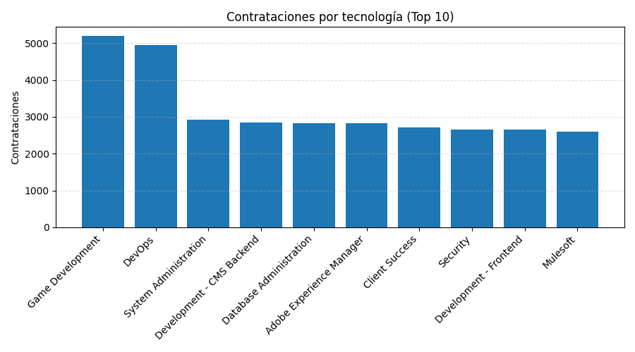
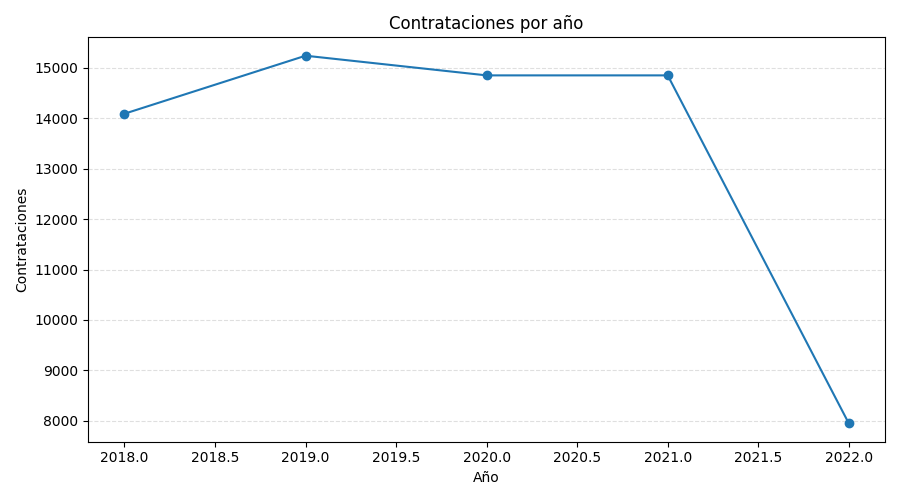

````md
# Workshop-1 · ETL → Data Warehouse (Star Schema) → KPIs & Charts

[](https://www.python.org/)
[](https://pandas.pydata.org/)
[](https://matplotlib.org/)
[](https://github.com/Textualize/rich)

Individual **ETL project in Python** that builds a **Data Warehouse (SQLite)** with a **star schema** from a candidates dataset, then computes **KPIs** and generates **charts** (PNG only).

> **Important:** *All metrics and charts are computed from the DW only.*  
> The CSV is used **only** to populate the DW (as RAW staging).

---

## 🧭 Table of Contents
- [Goal](#goal)
- [Preview](#preview)
- [Features](#features)
- [Architecture](#architecture)
- [Repository Structure](#repository-structure)
- [Requirements](#requirements)
- [Install & Run](#install--run)
- [KPIs](#kpis)
- [Troubleshooting](#troubleshooting)
- [License](#license)

---

## 🎯 Goal
- Implement an **ETL pipeline** (Extract → Transform → Load).
- Persist **RAW** and **CLEAN** stages **inside** the DW.
- Model a **star schema** (dimensions + fact).
- Compute **hiring KPIs** and generate **charts (PNG)**.

---

## 🖼️ Preview

<p align="center">
  
  
</p>

> The `visuals/` folder is generated by `main.py` and contains all PNG charts.

---

## ✨ Features
- **DW-driven**: KPIs/charts query **SQLite** (not the CSV).
- **RAW staging** in DW: exact CSV snapshot (`RawCandidates`).
- **CLEAN** in DW: normalized and typed (`CleanCandidates`).
- **Star schema**: `Dim*` + `FactHires`.
- **Console KPIs** with **Rich**.
- **Charts** as **PNG** (Matplotlib) → `visuals/`.

---

## 🏗️ Architecture

### Data Flow
```mermaid
flowchart LR
    CSV[data/candidates.csv] -->|Extract| RAW[RawCandidates (DW)]
    RAW -->|Transform| CLEAN[CleanCandidates (DW)]
    CLEAN --> D1[DimCandidate]
    CLEAN --> D2[DimTechnology]
    CLEAN --> D3[DimCountry]
    CLEAN --> D4[DimDate]
    D1 --> FACT[FactHires]
    D2 --> FACT
    D3 --> FACT
    D4 --> FACT
    FACT --> KPIs[KPIs (SQL)]
    FACT --> PNG[Charts (PNG)]
````

### Star Schema (ER)

```mermaid
erDiagram
    DimCandidate ||--o{ FactHires : candidate_id
    DimTechnology ||--o{ FactHires : technology_id
    DimCountry   ||--o{ FactHires : country_id
    DimDate      ||--o{ FactHires : date_id

    DimCandidate {
      int    candidate_id PK
      string first_name
      string last_name
      string email
      string seniority
      int    yoe
    }

    DimTechnology {
      int    technology_id PK
      string technology
    }

    DimCountry {
      int    country_id PK
      string country
    }

    DimDate {
      int    date_id PK
      string full_date
      int    year
      int    month
      int    day
    }

    FactHires {
      int   fact_id PK
      int   candidate_id FK
      int   technology_id FK
      int   country_id FK
      int   date_id FK
      float code_challenge_score
      float technical_interview_score
      int   hired
    }
```

---

## 📁 Repository Structure

```
workshop1_etl/
├─ data/
│  └─ candidates.csv          # (NOT committed) — only to populate the DW
├─ dw/
│  └─ workshop1_dw.sqlite     # (generated) — the SQLite DW
├─ sql/
│  └─ queries.sql
├─ src/
│  ├─ __init__.py
│  ├─ extract.py              # CSV → DataFrame
│  ├─ transform.py            # normalize/derive → CLEAN schema
│  └─ load.py                 # RAW/CLEAN/STAR loaders (SQLite)
├─ visuals/                   # PNG charts (Matplotlib)
├─ main.py                    # Orchestrates: CSV→RAW→CLEAN→STAR → KPIs/PNG
├─ requirements.txt
├─ .gitignore
└─ README.md
```

---

## ✅ Requirements

* **Python 3.10+**
* Install:

  ```bash
  pip install -r requirements.txt
  ```

  (Uses: `pandas`, `matplotlib`, `rich`)

---

## ⚙️ Install & Run

```bash
# optional venv
python -m venv .venv
# Windows: .venv\Scripts\Activate.ps1
# macOS/Linux: source .venv/bin/activate

pip install -r requirements.txt

# place semicolon-separated CSV:
#   data/candidates.csv
python main.py
```

Outputs:

* DW at `dw/workshop1_dw.sqlite`
* KPIs (console, via Rich)
* PNG charts in `visuals/`

---

## 📊 KPIs (DW only)

1. **Hires by technology** — Hires, Total, Rate %
2. **Hires by year** — Hires, Total, Rate %
3. **Hires by seniority** — Hires, Total, Rate %
4. **Hires by country (per year)** — Trend for US/Brazil/Colombia/Ecuador
5. **Hiring rate by country (%)** — Country ranking
6. **Average scores (Hired vs Not)** — Code Challenge & Interview

---

## 🛠️ Troubleshooting

* **CSV delimiter** must be `;` and **encoding** UTF-8.
* **Dates**: `YYYY-MM-DD`.
* **Windows line-endings notice** (`LF → CRLF`): harmless.
* **`database is locked`**: close any app using the `.sqlite` and rerun.

---

## 📜 License

MIT © 2025 — ShadowBlack33
