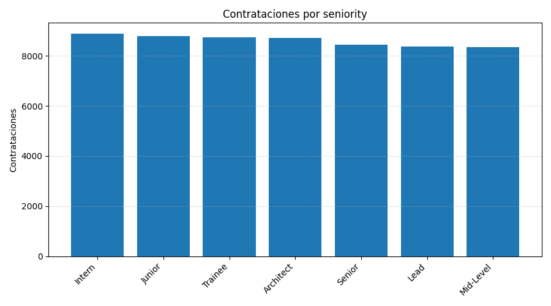
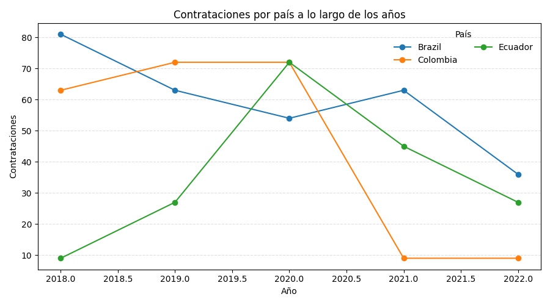

# Workshop-1 · ETL → Data Warehouse (Star Schema) → KPIs & Charts

[](https://www.python.org/)
[](https://pandas.pydata.org/)
[](https://matplotlib.org/)
[](https://github.com/Textualize/rich)

Individual **ETL project in Python** that builds a **Data Warehouse (SQLite)** using a **star schema** from a candidates dataset, then computes **KPIs** and generates **charts (PNG only)**.

> **Important:** *All metrics and charts are computed from the Data Warehouse only.*  
> The CSV is used **only** to populate the DW (as a RAW staging table).

---

## 🧭 Table of Contents
- [Goal](#goal)
- [Preview](#preview)
- [Features](#features)
- [Architecture](#architecture)
- [Star Schema – Design Rationale](#star-schema--design-rationale)
- [Repository Structure](#repository-structure)
- [Requirements](#requirements)
- [Install & Run](#install--run)
- [KPIs](#kpis)
- [SQL Reference](#sql-reference)
- [Troubleshooting](#troubleshooting)
- [License](#license)

---

## 🎯 Goal
- Implement a clear **ETL pipeline** (Extract → Transform → Load).
- Persist both **RAW** and **CLEAN** stages **inside** the DW.
- Model a **star schema** (dimensions + fact).
- Compute **hiring KPIs** and generate **PNG charts**.

---

## 🖼️ Preview

<p align="center">
  
  
</p>
<p align="center">
  
  
</p>

> The `visuals/` folder is generated by `main.py` and contains all PNG charts.

---

## ✨ Features
- **DW-driven analytics:** KPIs/charts query **SQLite** (not the CSV).
- **RAW staging** in DW: exact CSV snapshot → `RawCandidates`.
- **CLEAN** in DW: normalized/typed dataset → `CleanCandidates`.
- **Star schema** in DW: `Dim*` + `FactHires`.
- **Console KPIs** with **Rich**.
- **PNG charts** with **Matplotlib** → `visuals/`.

---

## 🏗️ Architecture

### Data Flow
```mermaid
flowchart LR
  A["CSV: data/candidates.csv"];
  B["RawCandidates (DW)"];
  C["CleanCandidates (DW)"];
  D["DimCandidate"];
  E["DimTechnology"];
  F["DimCountry"];
  G["DimDate"];
  H["FactHires"];
  I["KPIs (SQL)"];
  J["Charts (PNG)"];

  A -->|Extract| B;
  B -->|Transform| C;
  C --> D;
  C --> E;
  C --> F;
  C --> G;
  D --> H;
  E --> H;
  F --> H;
  G --> H;
  H --> I;
  H --> J;
````

### Star Schema (ER)

```mermaid
erDiagram
  DIMCANDIDATE ||--o{ FACTHIRES : candidate_id
  DIMTECHNOLOGY ||--o{ FACTHIRES : technology_id
  DIMCOUNTRY ||--o{ FACTHIRES : country_id
  DIMDATE ||--o{ FACTHIRES : date_id

  DIMCANDIDATE {
    int    candidate_id PK
    string first_name
    string last_name
    string email
    string seniority
    int    yoe
  }

  DIMTECHNOLOGY {
    int    technology_id PK
    string technology
  }

  DIMCOUNTRY {
    int    country_id PK
    string country
  }

  DIMDATE {
    int    date_id PK
    string full_date
    int    year
    int    month
    int    day
  }

  FACTHIRES {
    int   fact_id PK
    int   candidate_id FK
    int   technology_id FK
    int   country_id FK
    int   date_id FK
    float code_challenge_score
    float technical_interview_score
    int   hired
  }
```

---

## Star Schema – Design Rationale

* **Fact grain:** one row per application (candidate × application date) with `code_challenge_score`, `technical_interview_score`, and `hired`.
* **Dimensions:**

  * `DimCandidate` — attributes for segmentation (seniority, `yoe`), stable identifiers (`email`).
  * `DimTechnology` — technology associated to the process.
  * `DimCountry` — geographic breakdown and focus countries.
  * `DimDate` — standardized calendar cuts (year/month/day).
* **Why this works:** directly answers KPIs (by tech/year/seniority/country) and supports derived metrics (hire rate, averages) with simple, efficient SQL.

---

## 📁 Repository Structure

```
workshop1_etl/
├─ data/
│  └─ candidates.csv          # (NOT committed) — only to populate the DW
├─ dw/
│  └─ workshop1_dw.sqlite     # (generated) — the SQLite DW
├─ sql/
│  └─ queries.sql             # KPI queries (reference)
├─ src/
│  ├─ __init__.py
│  ├─ extract.py              # CSV → DataFrame
│  ├─ transform.py            # normalize/derive → CLEAN schema
│  └─ load.py                 # RAW/CLEAN/STAR loaders (SQLite)
├─ visuals/                   # PNG charts (Matplotlib)
├─ main.py                    # Orchestrates: CSV→RAW→CLEAN→STAR → KPIs/PNG
├─ requirements.txt
├─ .gitignore
└─ README.md
```

---

## ✅ Requirements

* **Python 3.10+**
* Install:

  ```bash
  pip install -r requirements.txt
  ```

  Uses: `pandas`, `matplotlib`, `rich`

---

## ⚙️ Install & Run

```bash
# optional venv
python -m venv .venv
# Windows: .venv\Scripts\Activate.ps1
# macOS/Linux: source .venv/bin/activate

pip install -r requirements.txt

# place semicolon-separated CSV:
#   data/candidates.csv
python main.py
```

Outputs:

* DW at `dw/workshop1_dw.sqlite`
* KPIs (console, via Rich)
* PNG charts in `visuals/`

> CSV schema and details: see `data/README.md`.

---

## 📊 KPIs

All KPIs are computed from **FactHires** joined with dimensions:

1. **Hires by technology** — Hires, Total, Rate %
2. **Hires by year** — Hires, Total, Rate %
3. **Hires by seniority** — Hires, Total, Rate %
4. **Hires by country (per year)** — Trend for US/Brazil/Colombia/Ecuador
5. **Hiring rate by country (%)** — Country ranking
6. **Average scores (Hired vs Not)** — Code Challenge & Interview

---

## 🧾 SQL Reference

See `sql/queries.sql` for the exact SQL used for the KPIs.

---

## 🛠️ Troubleshooting

* CSV delimiter **must be `;`** and encoding **UTF-8**.
* Dates **YYYY-MM-DD**.
* Windows line-endings notice (`LF → CRLF`): harmless.
* `sqlite3.OperationalError: database is locked` → close any app using the `.sqlite` and rerun.
* If you changed CSV headers, the pipeline automatically normalizes them; ensure the CSV has at least: first/last name, email, seniority, `yoe`, technology, country, application date, code/interview scores.

---

## 📜 License

MIT © 2025 — ShadowBlack33